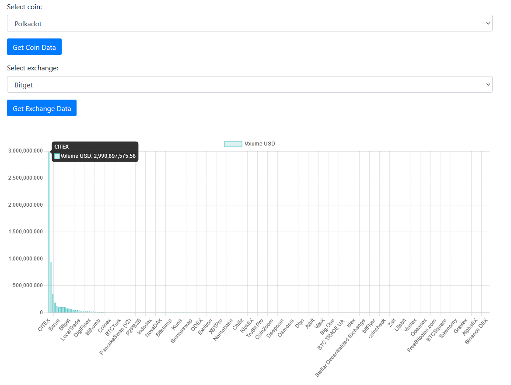

NOTE: small school project.

Web viewer for various exchanges and crypto coins. Shows useful graphs for analytics purposes. No api auth required.
To install, simply download the project and 'flask run'.

